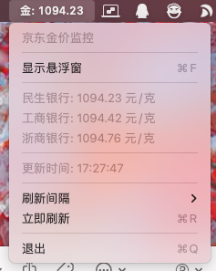

# JDGold

<p align="center">
  
</p>

<p align="center">
  <b>Your real-time gold price monitor on macOS</b>
</p>

<p align="center">
  一个极简的 macOS 菜单栏应用，实时监控国内外黄金价格。
</p>

<p align="center">
  
  
  
</p>

## 功能特性

- 📊 **菜单栏显示** - 实时在菜单栏显示金价和涨跌幅
- 🪟 **悬浮窗** - 可拖拽的悬浮窗，始终置顶显示
- 🏦 **国内金价** - 民生银行、工商银行、浙商银行
- 🌍 **国际金价** - 伦敦金 (XAU)、纽约金 (COMEX)
- 📈 **涨跌显示** - 实时显示涨跌幅，涨红跌绿
- ⏱️ **自动刷新** - 支持 3/5/10/30/60 秒刷新间隔
- 🎨 **极简设计** - 单文件 ~570 行代码，无任何依赖

## 截图

### 菜单栏下拉菜单
<p align="center">
  
</p>

### 悬浮窗
<p align="center">
  
</p>

## 安装

### 方式一：直接下载（推荐）
1. 从 [Releases](https://github.com/PiaoyangGuohai1/GoldPrice/releases/latest) 下载 `JDGold-v1.5.0.zip`
2. 解压后将 `JDGold.app` 拖入「应用程序」文件夹
3. 首次运行：右键点击 → 打开

### 方式二：从源码编译
```bash
git clone https://github.com/PiaoyangGuohai1/GoldPrice.git
cd GoldPrice
chmod +x build.sh
./build.sh
open JDGold.app
```

## 使用说明

1. 启动应用后，菜单栏右侧会显示金价和涨跌幅
2. 点击菜单栏图标可查看国内外金价详情
3. 选择「显示悬浮窗」(⌘F) 可打开悬浮窗
4. 悬浮窗可拖拽到任意位置

### 快捷键

| 快捷键 | 功能 |
|--------|------|
| ⌘F | 显示/隐藏悬浮窗 |
| ⌘R | 立即刷新 |
| ⌘Q | 退出应用 |

## 首次运行

由于应用未经 Apple 签名，首次运行时 macOS 可能会阻止。请按以下步骤操作：

1. 右键点击 `JDGold.app`
2. 选择「打开」
3. 在弹出的对话框中点击「打开」

或者在终端执行：
```bash
xattr -cr /Applications/JDGold.app
```

## 开机自启动

1. 打开「系统偏好设置」→「通用」→「登录项」
2. 点击「+」添加 `JDGold.app`

## 数据来源

**国内金价** - 京东金融 API：
- 民生银行积存金
- 工商银行积存金
- 浙商银行积存金

**国际金价** - 新浪财经 API：
- 伦敦金 (XAU) - 现货黄金
- 纽约金 (GC) - COMEX 期货

## 技术栈

| 项目 | 说明 |
|------|------|
| 语言 | Swift 5.9 |
| 框架 | AppKit (原生 macOS) |
| 代码量 | ~570 行 |
| 依赖 | 无 |

## 项目结构

```
JDGold/
├── Sources/
│   └── main.swift      # 全部源代码
├── Resources/
│   ├── AppIcon.icns    # 应用图标
│   ├── AppIcon.iconset # 图标源文件
│   └── screenshots/    # 截图
├── Info.plist          # 应用配置
├── build.sh            # 构建脚本
└── README.md
```

## 系统兼容性

- **支持架构**：Apple Silicon (arm64) + Intel (x86_64) Universal Binary
- **最低系统要求**：macOS 12.0 (Monterey)

## 构建要求

- macOS 12.0+
- Xcode Command Line Tools

## License

MIT License

## 作者

[@PiaoyangGuohai1](https://github.com/PiaoyangGuohai1)
